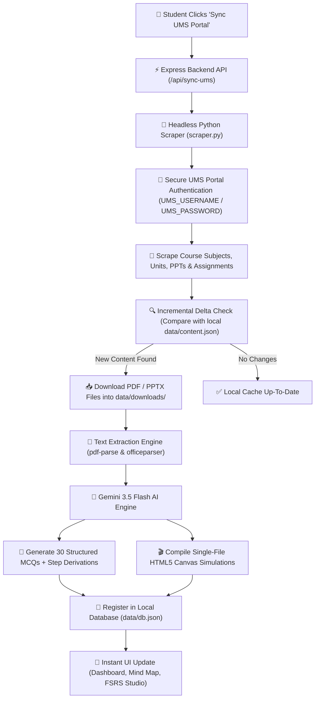

# 🧠 SynapseLab AI - Interactive Learning & Memory Engine

> A next-generation, AI-powered educational web application combining **FSRS Spaced Repetition**, **Gizmo-style Interactive Canvas Simulations**, **Automated 30-MCQ Generation from PDF/Office Courseware**, **Automated University UMS Portal Incremental Sync**, and **5-Tier Hierarchical Concept Mind Maps**.

---

## 🍌 Gemini Nano & Multimodal AI Pipeline Infographic

SynapseLab AI implements a **Dual-Tier Hybrid AI Architecture**, pairing **On-Device Local Gemini Nano (Banana Engine)** for ultra-fast blueprint prompt generation, instant clipboard copying, and FSRS memory metrics with **Gemini 3.5 Flash Cloud** for heavy multimodal document parsing and HTML5 physics compilation.

```mermaid
flowchart LR
    subgraph LocalEdge["🍌 Local Edge & Gemini Nano (On-Device Engine)"]
        direction TB
        N1["📱 On-Device Prompt Tuning System"]
        N2["⚡ Fast Prompt-Only Blueprint Compiler (-- words)"]
        N3["📋 Instant Canvas Prompt Clipboard Sync"]
        N4["🧠 Local FSRS Memory Metrics Calculation"]
    end

    subgraph CloudMultimodal["☁️ Gemini 3.5 Flash Cloud Engine"]
        direction TB
        C1["📄 PDF / PPTX Vision & Multimodal Extraction"]
        C2["🎯 Automated 30-MCQ Courseware Generation"]
        C3["🎬 HTML5 Physics Canvas Simulation Compiler"]
        C4["🔊 Web Audio SFX & Speech Synthesis Engine"]
    end

    LocalEdge <===> |"Dual-Routing Realtime Bridge"| CloudMultimodal
```



### 🍌 Gemini Nano & Prompt Tuning Engine Highlights:
- **⚡ Prompt-Only Fast Auto-Run Mode**: Generates Gemini Canvas instruction prompts in 2–3 seconds per question, completely bypassing heavy code compilation limits.
- **📋 Exact Word Count Display**: Every question card displays exact blueprint length before copying: `Copy Canvas Prompt (845 words)`.
- **🛡️ Guaranteed Blueprint Fallback**: Incorporates your custom **Prompt Tuning Engine (System Prompt)** from Settings into every generated prompt.
- **🔢 Sequential Unit Progression**: Automatic 1-to-N numerical unit ordering across Mind Maps, Sidebar Navigation, Dashboard, and Prep Planner.

---

## 🔄 Automated UMS Portal Sync & Incremental Scraper Architecture

SynapseLab AI features a seamless, one-click integration with University LMS/UMS Portals. When you click **"Sync UMS Portal"** in the top bar, the engine triggers an automated, incremental scraping and simulation compiling pipeline:

### 📊 System Architecture & Data Flow



### ⚙️ How UMS Incremental Sync Works Under the Hood:
1. **One-Click Portal Trigger**: Clicking `Sync UMS Portal` sends a signal to the Express backend (`server/index.js`), which spawns the Playwright-based Python scraper.
2. **Secure Login**: The scraper reads login credentials securely from environment variables (`UMS_USERNAME`, `UMS_PASSWORD`) or local configuration, navigates to the university portal, selects the student role, and logs in.
3. **Incremental Delta Scan**: Rather than re-downloading existing files, the scraper performs an incremental scan comparing online syllabus IDs against `data/content.json`. Only newly uploaded assignments, e-notes, and lecture slides are downloaded.
4. **Automated Content Parsing & AI Compilation**: Downloaded `.pdf` and `.pptx` files are parsed into structured text. Gemini AI generates 30 syllabus-aligned MCQs per unit alongside 2D interactive HTML5 physics canvas simulations for every topic.
5. **Instant Live Dashboard Sync**: Updated subjects, units, questions, and simulation paths are saved to `data/db.json` and immediately rendered across the Navigation Tree, Mind Map, and FSRS Studio.

---

## 🌟 Key Features Overview

### 1. 🎯 Gizmo-Style Interactive MCQ Simulation Reviewer
* **Dual-Pane Split Screen**:
  * **Left Panel**: Compiled interactive 2D HTML5 Canvas / SVG simulation sandbox.
  * **Right Panel**: Real-time evaluation dashboard with question text, option choices, mathematical derivations, and FSRS scheduling metrics.
* **🔀 Dynamic Option Shuffling**: Options are randomized upon card load using the Fisher-Yates algorithm while preserving underlying answer key mappings.
* **🔗 Bidirectional `postMessage` Protocol**: Secure communication between the compiled simulation `iframe` and the parent React app. Answer keys are strictly retained on the host application for maximum security.
* **🔊 Audio Text-to-Speech (TTS)**: Built-in Web Speech API narration reads out questions, options, and conceptual explanations.
* **⏭️ Continuous Review Flow**: One-click "Next MCQ" navigation lets students progress seamlessly through their active deck.

---

### 2. 📚 Automated 30-MCQ Generator & Multi-Format Course Scanner
* **Courseware Material Scanner**:
  * Recursively scans course material directories for three distinct material types:
    * 📝 **Assignments** (`.pdf`, `.docx`)
    * 💻 **Presentations / PPTs** (`.pptx`, `.ppt`)
    * 📖 **E-Notes & Handouts** (`.pdf`, `.docx`)
* **Hierarchical Selector**: Materials are cleanly categorized in frontend dropdowns under:
  $$\text{Subject} \rightarrow \text{Unit Number} \rightarrow \text{Material Type (Assignment / PPT / E-Note)}$$
* **Automated AI Question Generation**: Converts extracted text into exactly 30 structured, syllabus-aligned multiple-choice questions with step-by-step derivations and FSRS database registration.
* **Multi-Model Selector**: Support for `gemini-3.5-flash`, `gemini-2.5-flash`, and `gemini-3.1-flash-lite`.

---

### 3. ⚡ FSRS Spaced Repetition Engine & Analytics
* **Mathematical Memory Modeling**: Implements the Free Spaced Repetition Scheduler algorithm ($R = e^{-t/S}$) tracking memory stability ($S$) and item difficulty.
* **7-Day Review Schedule Forecast**: Bar timeline showing card review load across upcoming days.
* **Student Mastery Analytics**: Graphs tracking student score improvement trends and average difficulty progression.
* **Dynamic Rating System**: Review outcomes dynamically reschedule cards:
  * **Good (8)** / **Easy (10)**: Increases stability interval.
  * **Again (1)**: Resets stability interval for immediate active review.

---

### 4. 🗺️ 5-Tier Hierarchical Mind Map Explorer
* High-fidelity, responsive tree navigator mapping study items across:
  $$\text{FSRS Deck} \rightarrow \text{Subject Hub} \rightarrow \text{Unit} \rightarrow \text{Assignment} \rightarrow \text{MCQ / Concept Group} \rightarrow \text{Card Nodes}$$
* Clickable card nodes with instant review launchers and status indicators (**DUE**, **Good**, **Hard**).

---

### 5. 🔬 Multi-Layer AI Simulation Compiler (Two-Stage Architecture)
* **Stage 1 (Blueprint Generator)**: Prompts Gemini models to write comprehensive 800-1200 word pedagogical blueprints detailing physics loops, vector graphics, drag-and-drop slots, and Web Audio triggers.
* **Stage 2 (Canvas Code Compiler)**: Compiles single-file HTML/CSS/JS interactive sandboxes with dark cyber glassmorphism, responsive Retina canvas scaling, and fluid animations.
* **Variant Management**: Support for original simulations, adaptive review variants, and custom user-pasted HTML/JS code snippets.

---

### 6. 💬 Persistent Guided Learning & Conversation Autosaving
* **Debounced Autosave**: Guided learning chat history automatically syncs to `db.json` after a 500ms typing pause.
* **Safe Circular Copy Utility**: Safari-safe clipboard copying with fallback selection ranges and interactive prompt dialogs.

---

### 7. 🏛️ RCC Beam & Structural Engineering Pedagogy Engine
* Interactive parameter highlight checklists ($b, D, c, A_{st}, A_{sc}$).
* Real-time canvas section drafting animations with staggered leader callouts.
* Gamified IS 456 Codebook reference lookup challenges.
* Parallel concrete parabolic stress block & strain profile visualizers.

---

## 🏗️ Tech Stack

* **Frontend**: React 19, TypeScript, Vite, Lucide React Icons, Vanilla Glassmorphism CSS.
* **Backend**: Node.js, Express 5, `pdf-parse`, `officeparser`, CORS.
* **Scraper**: Python 3, Playwright, BeautifulSoup4.
* **AI Engine**: `@google/generative-ai` (Gemini 3.5 Flash, Gemini 3.1 Flash Lite).
* **Storage**: Local JSON database (`data/db.json`, `data/settings.json`) with automated file system backups.

---

## 🚀 Getting Started

### 1. Prerequisites
* **Node.js** (v18 or higher)
* **Python 3.10+** (with Playwright for UMS scraping)
* **npm** or **yarn**
* A **Gemini API Key** from [Google AI Studio](https://aistudio.google.com/)

---

### 2. Installation

```bash
# Clone the repository
git clone https://github.com/Happy123455/Interactive-Learning-Memory-Engine.git
cd Interactive-Learning-Memory-Engine

# Install Node dependencies
npm install

# Setup Python scraper environment (optional for UMS auto-sync)
pip install playwright beautifulsoup4
playwright install chromium
```

---

### 3. Environment Setup (UMS Portal Credentials)

Set your UMS portal login credentials safely via environment variables or settings:

```bash
export UMS_USERNAME="YOUR_STUDENT_ID"
export UMS_PASSWORD="YOUR_STUDENT_PASSWORD"
```

---

### 4. Running the Application

Launch both the backend server and frontend client concurrently:

```bash
# Run backend server & frontend Vite dev server
npm run dev
```

Open your browser and navigate to:
* **Local Web Interface**: [http://localhost:5173/](http://localhost:5173/)
* **Live GitHub Hosted Interface**: [https://happy123455.github.io/Interactive-Learning-Memory-Engine/](https://happy123455.github.io/Interactive-Learning-Memory-Engine/)

---

## 📜 License

This project is open-source under the MIT License.
